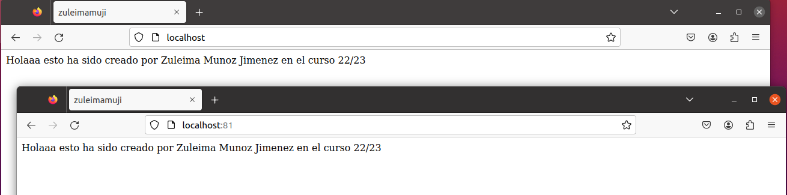
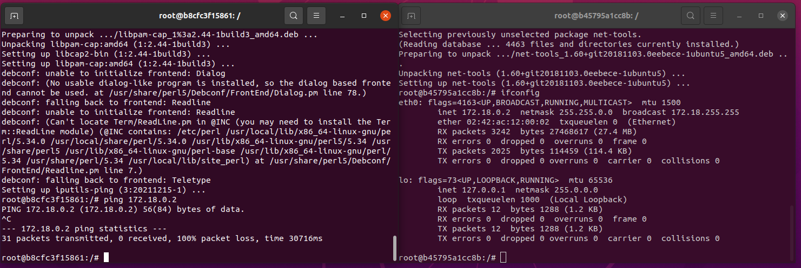
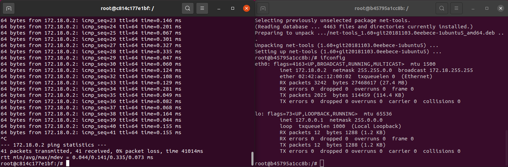

# Práctica 2
## Parte 1
Para comenzar con la práctica creamos un volumen haciendo uso del comando:


`docker volume create volumeDocker`


Con este comando hemos podido crear el volumen con el nombre indicado en el enunciado. Una vez tenemos el volumen pasamos a crear nuestro contenedor Nginx haciendo uso del comando:


`docker run -d -p 80:8080 --name=ContenedorNginx --mount type=volume,source=volumeDocker,target=/app bitnami/apache`


Tras esto hemos creado un contenedor el cual hemos añadido al volumen que acabamos de crear y adelantándonos un poco le hemos asignado el puerto 80. Procedemos a comprobar que el contenedor está vacío y actualizamos el _index.html_ añadiendole un saludo personal. Esto lo conseguiremos haciendo uso de los siguientes comandos:


  * `docker exec -it --user=root ContenedorNginx /bin/bash` --> Para acceder a un terminal del contenedor.
  * `nano index.html` --> Para acceder y modificar el fichero _index.html_.


Cabe destacar que tenemos que instalar las herramientas necesarias para poder hacer uso del nano, comandos que considero irrelevantes en la redacción de la resolución de la práctica ya que son de conocimiento general y si los incluimos alargaríamos la resolución innecesariamente llegando a ser tedioso su contenido.


Continuando con la resolución, tras acceder al fichero _index.html_ lo modificados quedando en mi caso su contenido tal que así:


```html
<html>
    <head>
        <title>zuleimamuji</title>
    </head>
    <body>
        <p>Holaaa esto ha sido creado por Zuleima Munoz Jimenez en el curso 22/23</p>
    </body>
</html>
```


Tras guardar el fichero, hemos acabado con este contenedor y procedemos a crear el segundo contenedor solicitado por el enunciado de la práctica. Para la creación de este contenedor hacemos uso del comando:


`docker run -d -p 81:8080 --name=ContenedorNginx2 --mount type=volume,source=volumeDocker,target=/app bitnami/apache`


Una vez creado, podemos decir que al haber usado el mismo volumen en la creación de este contenedor que en del contenedor anterior, el segundo contenedor tiene el mismo contenido que el primero. Para comprobar que esto es cierto, abrimos dos pestañas de nuestro navegador y accedemos a cada uno de ellos haciendo uso de:


  * `localhost:80` para el primer contenedor.
  * `localhost:81` para el segundo contenedor.


Tras hacer esto, podemos comprobar que efectivamente ambos contenedores tienen el mismo contenido.





## Parte 2
Comenzamos esta parte de la práctica creando la red y los dos contenedores solicitados, para ello usamos:


  * `docker network create redDocker` para crear la red.
  * `docker run -d -t -i --name Ubuntu1 --network redDocker ubuntu` para crear el primer contenedor Ubuntu1 conectado a la red.
  * `docker run -d -t -i --name Ubuntu1 ubuntu` para crear el segundo contenedor Ubuntu2.

Procedemos a abrir las terminales internas de los contenedores usando los comandos `docker exec -it Ubuntu1 /bin/bash` y `docker exec -it Ubuntu2 /bin/bash`  y consultamos la ip del contenedor _Ubuntu1_ y realizamos ping a este desde la terminal del contenedor _Ubuntu2_. Tras esto podemos comprobar que no funciona el ping, esto pasa porque el contenedor _Ubuntu2_ no está conectado a la red creada.





Por eso, procedemos a conectar el contenedor _Ubuntu2_ a la red. Para hacer esto, eliminamos el contenedor existente usando `docker rm Ubuntu2` y creamos el contenedor de nuevo pero esta vez usando el comando:


`docker run -d -t -i --name Ubuntu2 --network redDocker ubuntu`


Una vez tenemos el contenedor creado de nuevo y conectado a la red, procedemos a realizar nuevamente los pasos para realizar un ping entre ambos contenedores. A diferencia del intento anterior, este ping se produce de forma exitosa, debido a que ambos contenedores están conectados a la misma red haciendo factible el ping.



