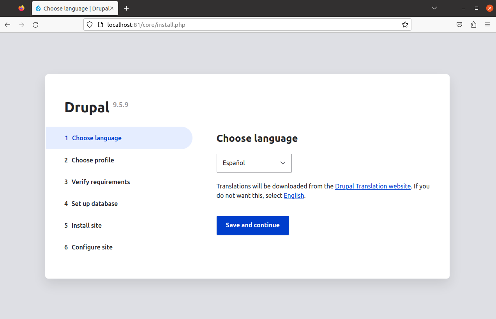

# Práctica 3
## Parte 1
Para comenzar con la práctica creamos un fichero _docker-compose.yml_ que use los servicios de drupal y MySQL. Obteniendo como resultadi lo siguiente:

```yml
version: '3.1'

services:
  db:
    image: mysql:5.7
    volumes:
      - volumenDocker:/var/lib/mysql
    environment:
      MYSQL_ROOT_PASSWORD: iiss
  drupal:
    image: drupal:9-apache
    ports:
      - "81:80"
    volumes:
      - volumenDocker:/var/www/html
    environment:
      DRUPAL_DATABASE_HOST: db
      DRUPAL_DATABASE_NAME: drupal
      DRUPAL_DATABASE_USER: drupal
      DRUPAL_DATABASE_PASSWORD: iiss

volumes:
  volumenDocker:
```


Lo que hemos hecho ha sido crear un fichero docker compose en el que detallamos los servicios solicitados. Cabe destacar que el servicio drupal tiene asociado el puerto 81 como el enunciado solicita. 


Una vez configurado, procedemos a ejecutar:


`sudo docker-compose up`


Esto hace que al acceder a `localhost:81` obtengamos lo que podemos ver en la siguiente imagen.





## Parte 2
Comenzamos esta parte de la práctica creando un archivo como el anterior, pero esta vez usando los servicios wordpress y mariadb. Obtenemos lo siguiente:


```yml
version: "3"

services:

 wordpress:
   image: bitnami/wordpress:latest
   container_name: wordpress_
   environment:
     - ALLOW_EMPTY_PASSWORD=yes
     - WORDPRESS_DATABASE_USER=bn_wordpress
     - WORDPRESS_DATABASE_NAME=bitnami_wordpress
   ports:
     - 82:8080
   networks:
     - redDockerC
 
 mariadb:
   image: bitnami/mariadb:latest
   container_name: mariadb
   environment:
     - ALLOW_EMPTY_PASSWORD=yes
     - MARIADB_USER=bn_wordpress
     - MARIADB_DATABASE=bitnami_wordpress
   networks:
     - redDockerC

networks:
 redDockerC:
```


Este fichero contiene ambos servicios en el que hemos usado la imagen de prácticas anteriores, además de las variables de entorno también contenidas en éstas.

Después de esto, hemos relacionado el servicio wordpress con el puerto 82, como nos pide el enunciado. Y para finalizar, hemos conectado ambos servicios a la misma red usando _networks_.


Hacemos uso de `sudo docker-compose up` y tras esto, si accedemos en nuestro navegador a `localhost:82` tendremos un resultado satisfactorio en la resolución de este ejercicio.


